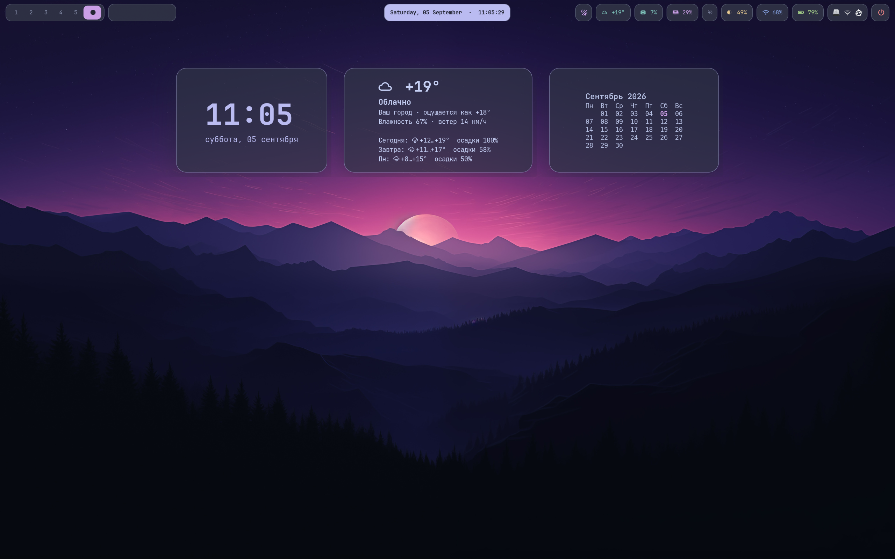
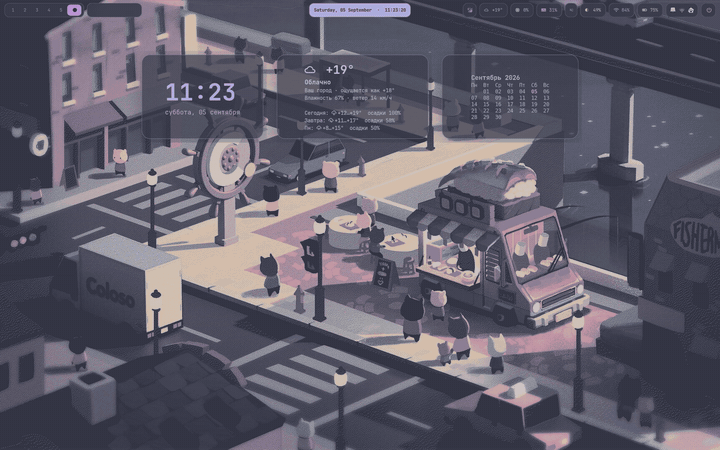
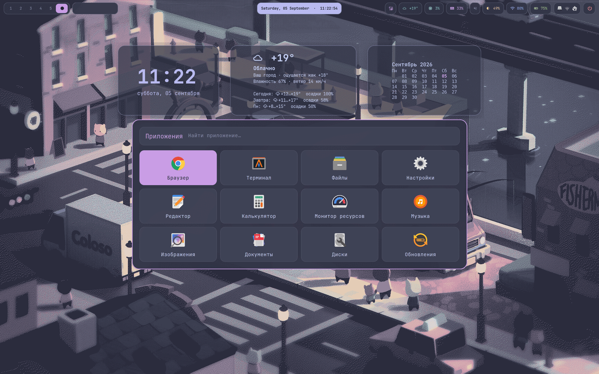
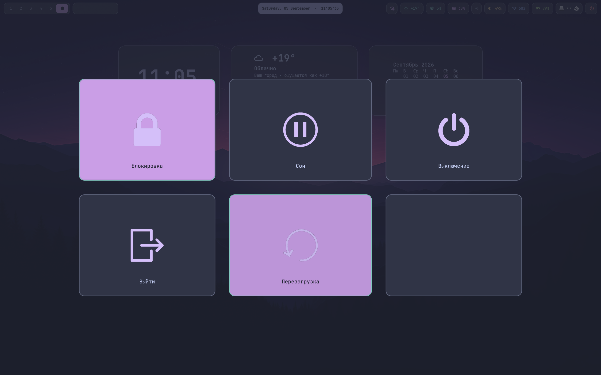

# Hyprland для Ubuntu

Готовый рабочий стол на Hyprland: панель Waybar, меню приложений, виджеты с
часами и погодой, экран блокировки, уведомления, две цветовые темы и
автоматическая смена обоев.



[](docs/media/demo.mp4)

<table>
  <tr>
    <td width="50%"></td>
    <td width="50%"></td>
  </tr>
  <tr>
    <td align="center">Меню приложений</td>
    <td align="center">Меню питания</td>
  </tr>
</table>

Конфигурация собрана и проверена на Ubuntu 26.04 LTS с Hyprland 0.56.2. Она
подходит и для ноутбука, и для обычного компьютера. После установки нужно лишь
указать свои мониторы и при необходимости изменить устройства батареи и
подсветки.

## Что будет установлено

- Hyprland с анимациями, прозрачностью и готовыми горячими клавишами;
- Waybar и виджеты рабочего стола, автоматически скрывающиеся под окнами;
- Rofi с сеткой приложений и иконками Papirus;
- GTKlock для блокировки экрана;
- Wlogout для выхода, сна, перезагрузки и выключения;
- Mako, Alacritty, Cava, Fastfetch и Starship;
- темы Frappe и Latte;
- набор обоев со сменой каждые 10 минут.

Полный список пакетов находится в [packages.txt](packages.txt).

## Установка на чистую Ubuntu

Сначала установите Git и GitHub CLI:

```bash
sudo apt update
sudo apt install -y git gh
gh auth login
```

Скачайте репозиторий. Вместо `OWNER` укажите имя владельца на GitHub:

```bash
mkdir -p ~/.local/share
gh repo clone OWNER/hyprland-ubuntu-config \
  ~/.local/share/hyprland-config-backup
cd ~/.local/share/hyprland-config-backup
./restore.sh
```

`restore.sh` установит недостающие пакеты, скопирует конфиги, темы, иконки,
шрифты и обои, а также создаст команды `hypr-backup` и `hypr-restore`. Для
установки системных пакетов и настройки экрана блокировки потребуется пароль
`sudo`.

Когда установка закончится, выйдите из системы. На экране входа выберите сеанс
**Hyprland** и войдите снова.

## Восстановление настроек

Полное восстановление:

```bash
hypr-restore
```

Только пользовательские конфиги, без установки пакетов и изменения PAM:

```bash
hypr-restore --configs-only
```

Перед заменой файлов создаётся копия текущих настроек:

```text
~/.local/state/hyprland-restore/ДАТА-ВРЕМЯ
```

## Что настроить под свой компьютер

### Монитор и разрешение

Откройте `~/.config/hypr/hyprland.conf`. Названия мониторов и доступные режимы
можно посмотреть командой:

```bash
hyprctl monitors all
```

Строка монитора имеет такой формат:

```text
monitor = ИМЯ,РАЗРЕШЕНИЕ@ЧАСТОТА,ПОЛОЖЕНИЕ,МАСШТАБ
```

Примеры:

```ini
# Экран ноутбука: 2560×1600, 120 Гц
monitor = eDP-1,2560x1600@120,0x0,1.333333

# Монитор Full HD: 1920×1080, 144 Гц
monitor = DP-1,1920x1080@144,0x0,1

# Второй монитор справа от первого
monitor = HDMI-A-1,2560x1440@60,1920x0,1
```

Для автоматического выбора разрешения используйте:

```ini
monitor = ,preferred,auto,auto
```

После изменения сохраните файл и выполните `hyprctl reload`.

### Батарея и подсветка

Эти модули находятся в `~/.config/waybar/config.jsonc`.

Узнать название батареи:

```bash
ls /sys/class/power_supply
```

Узнать название устройства подсветки:

```bash
ls /sys/class/backlight
```

Подставьте найденные значения в параметры `bat` и `device`. На настольном
компьютере модули `battery` и `backlight` можно убрать из `modules-right`.

### Клавиатура и тачпад

Настройки находятся в блоке `input` файла `~/.config/hypr/hyprland.conf`:

```ini
kb_layout = us,ru
kb_options = grp:alt_shift_toggle
```

Раскладка переключается через `Alt+Shift`. Параметры тачпада расположены ниже,
в блоке `touchpad`.

### Программы

В начале `~/.config/hypr/hyprland.conf` можно выбрать свои программы:

```ini
$terminal = alacritty
$fileManager = nautilus --new-window
$browser = google-chrome-stable https://www.google.com
$menu = rofi -show drun -theme ~/.config/rofi/launcher.rasi
```

Например, для Firefox замените значение `$browser` на `firefox`.

### Погода

Погода работает через Open-Meteo и не требует API-ключа. Создайте локальный
файл настроек:

```bash
mkdir -p ~/.config/hyprpuccin
nano ~/.config/hyprpuccin/weather.json
```

Вставьте в него свой город и координаты:

```json
{
  "city": "Ваш город",
  "latitude": 0.0,
  "longitude": 0.0,
  "timezone": "auto"
}
```

Затем ограничьте доступ к файлу:

```bash
chmod 600 ~/.config/hyprpuccin/weather.json
```

Настройки погоды остаются только на компьютере и не попадают в резервную
копию.

### Обои

Сложите изображения в `~/Pictures/Wallpapers`. Если в системе используется
локализованный каталог изображений, скрипт найдёт его через XDG.

- `Super+W` сразу включает следующие обои;
- `HYPR_WALLPAPER_INTERVAL` меняет интервал в секундах;
- `HYPR_WALLPAPER_DIR` задаёт другой каталог.

По умолчанию обои меняются каждые 10 минут.

### Прозрачность, размытие и тени

Они настраиваются в блоке `decoration` файла
`~/.config/hypr/hyprland.conf`:

```ini
active_opacity = 0.85
inactive_opacity = 0.40
```

`active_opacity` относится к активному окну, `inactive_opacity` — ко всем
остальным. Размытие находится в блоке `blur`, тени — в блоке `shadow`.

## Горячие клавиши

| Сочетание | Действие |
|---|---|
| `Super+Enter` | Открыть терминал |
| `Super+Space` | Открыть меню приложений |
| `Super+Tab` | Выбрать открытое окно |
| `Super+R` | Запустить команду |
| `Super+E` | Открыть файловый менеджер |
| `Super+B` | Открыть браузер |
| `Super+Q` | Закрыть активное окно |
| `Super+F` | Полноэкранный режим |
| `Super+V` | Переключить плавающий режим окна |
| `Super+T` | Выбрать Frappe или Latte |
| `Super+X` | Открыть историю буфера обмена |
| `Super+W` | Включить следующие обои |
| `Super+L` | Заблокировать экран |
| `Super+Shift+Q` | Открыть меню питания |
| `Super+1…0` | Перейти на рабочий стол 1…10 |
| `Super+Shift+1…0` | Перенести окно на другой рабочий стол |
| `Alt+Shift` | Переключить раскладку |

В меню Rofi начните печатать название, выберите пункт стрелками и нажмите
`Enter`. Клавиша `Esc` закрывает меню.

Более подробная памятка находится в
[Шпаргалка-Hyprland.txt](Шпаргалка-Hyprland.txt).

## Резервная копия

Сохранить текущие настройки и отправить изменения на GitHub:

```bash
hypr-backup
```

Создать коммит только локально:

```bash
hypr-backup --no-push
```

Команда копирует используемые конфиги и скрипты в
`~/.local/share/hyprland-config-backup`, проверяет их и создаёт коммит. Если
эта папка будет удалена, `hypr-backup` и `hypr-restore` попробуют скачать её
заново с GitHub.

## Где что находится

| Каталог | Содержимое |
|---|---|
| `hypr/` | Hyprland, Hypridle, внешний вид и горячие клавиши |
| `waybar/` | Верхняя панель и виджеты рабочего стола |
| `rofi/` | Меню приложений и выбор темы |
| `gtklock/` | Экран блокировки |
| `wlogout/` | Меню питания |
| `alacritty/` | Терминал |
| `mako/` | Уведомления |
| `cava/` | Музыкальный визуализатор |
| `fastfetch/` | Информация о системе |
| `bin/` | Вспомогательные скрипты |
| `assets/` | Обои, темы, иконки и шрифты |
| `system/pam.d/` | PAM-настройки блокировки |

## Проверенные версии

| Компонент | Версия |
|---|---:|
| Ubuntu | 26.04 LTS |
| Hyprland | 0.56.2 |
| Waybar | 0.15.0 |
| GTKlock | 4.0.0 |
| Hypridle | 0.1.8 |
| Hyprlock | 0.9.6 |
| Rofi | 1.7.8 |
| Papirus Icons | 20250501+git20260316 |
| Alacritty | 0.16.1 |
| Wlogout | 1.2.2 |
| Mako | 1.10.0 |
| swww | 0.11.2 |
| Cava | 0.10.7 |
| Fastfetch | 2.57.1 |
